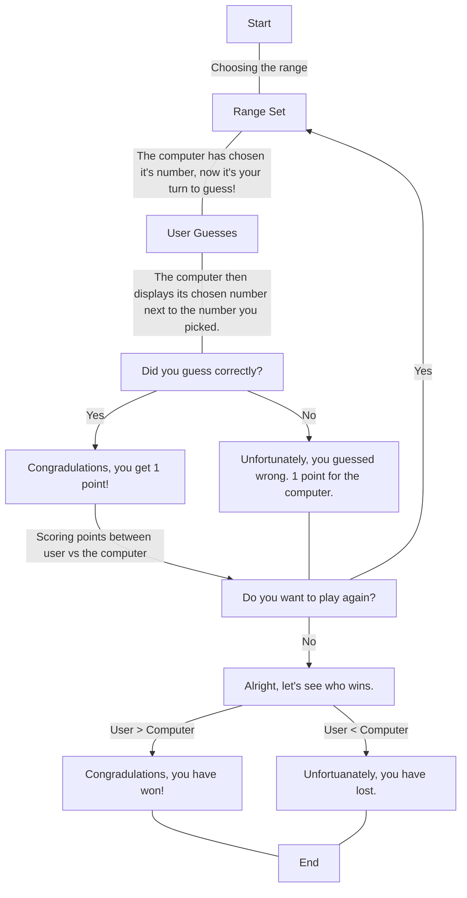

```mermaid
flowchart TD
A[Start]-- Choosing the range ---B[Range Set]-- The computer has chosen it's number, now it's your turn to guess! ---C[User Guesses]-- The computer then displays its chosen number next to the number you picked. ---D[Did you guess correctly?]
D -->|Yes| E[Congradulations, you get 1 point!]
D -->|No| F[Unfortunately, you guessed wrong. 1 point for the computer.]
E -->|Scoring points between user vs the computer| G[Do you want to play again?]
F --- G
G -->|Yes| B
G -->|No| H[Alright, let's see who wins.]
H -->|User > Computer| I[Congradulations, you have won!]
H -->|User < Computer| J[Unfortuanately, you have lost.]
I --- K[End]
J --- K[End]
```
